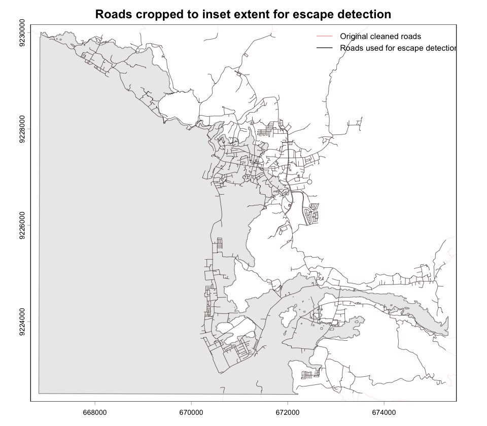
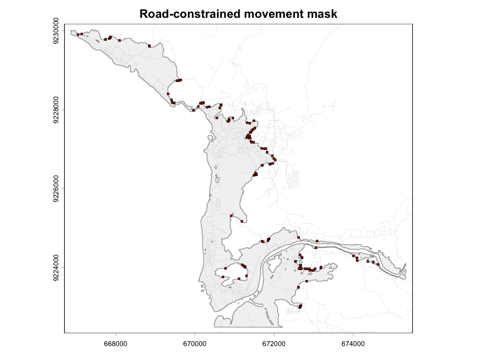
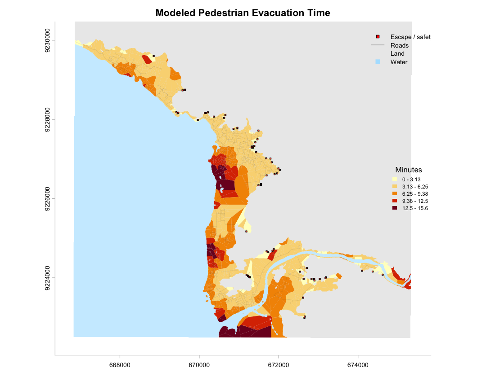

# evacpath

`evacpath` is an R package for road-constrained pedestrian evacuation modeling using least-cost path analysis. It takes generic hazard, road/pathway, and elevation inputs, then returns distance-to-safety and evacuation-time outputs for any projected study area.

The package is designed around a simple idea:

> hazard zone + roads/pathways + DEM + projected CRS -> distance-to-safety and evacuation-time outputs

## Current status

This is an initial package scaffold, not a polished CRAN release. It is ready for local development with `devtools::load_all()` and `devtools::document()`.

## Core workflow

```r
library(evacpath)

result <- run_evacpath(
  hazard_zone = "path/to/hazard_zone.tif",
  roads = "path/to/roads.gpkg",
  dem = "path/to/dem.tif",
  target_crs = "EPSG:XXXX",
  region_name = "Study area",
  road_buffer_m = 2,
  escape_buffer_m = 5,
  final_road_buffer_m = 3,
  max_origins = 2000,
  seed = 23401,
  walking_speed_mps = 1.22,
  clip_mode = "hazard",
  progress = TRUE
)

result$evac_polygons
result$distance_points

write_evac_outputs(
  result,
  output_dir = "outputs",
  prefix = "study_area"
)
```

## Main package functions

| Function | Purpose |
|---|---|
| `read_spatial()` | Reads either a file path or an existing `terra` object. |
| `prepare_hazard_zone()` | Converts an inundation raster into a hazard-zone raster or polygon. |
| `clean_roads()` | Removes roads/pathways based on user-defined attributes. |
| `prepare_evac_inputs()` | Reads and projects the hazard zone, roads, and DEM. |
| `make_evac_grid()` | Creates the evacuation grid over the hazard zone. |
| `find_escape_points()` | Finds candidate exits where roads cross the hazard boundary. |
| `make_road_mask()` | Buffers roads and escape points to constrain the DEM. |
| `make_road_origins()` | Creates road-based origin points inside the hazard zone. |
| `make_conductance_surface()` | Builds the slope-based conductance surface. |
| `calc_min_distance_to_safety()` | Calculates minimum least-cost distance to safety. |
| `calc_evac_time()` | Converts distance to evacuation time. |
| `make_evac_polygons()` | Creates Voronoi evacuation-distance/time polygons. |
| `run_evacpath()` | Runs the full workflow. |
| `write_evac_outputs()` | Writes the main outputs to disk. |

## Customizable assumptions

Most modeling assumptions are explicit parameters:

```r
run_evacpath(
  ...,
  target_crs = "EPSG:XXXX",
  grid_resolution = NULL,
  grid_resolution_factor = 5,
  road_buffer_m = 2,
  escape_buffer_m = 5,
  final_road_buffer_m = 3,
  dem_resolution = NULL,
  max_origins = 2000,
  walking_speed_mps = 1.22,
  clip_mode = "hazard"
)
```

## Tsunami preprocessing

Some coastal workflows need two tsunami zones. The land-only inundation zone is used for origins and mapping. A second zone combines the land inundation footprint with water so that the coastline is not treated as an artificial escape boundary.

```r
library(terra)
library(evacpath)

tsunami <- rast("path/to/inundation.nc")
dem <- rast("path/to/topography.nc")
roads <- vect("path/to/roads.shp")

zones <- prepare_tsunami_zones(
  inundation = tsunami,
  dem = dem,
  target_crs = "EPSG:XXXX",
  inundation_threshold = 0,
  dem_sign_multiplier = 1
)

roads <- clean_roads(
  roads,
  exclude = list(field = "road_type", values = "pier"),
  target_crs = "EPSG:XXXX"
)

result <- run_evacpath(
  hazard_zone = zones$hazard_zone,  # land-only TEZ for origins/output
  escape_zone = zones$escape_zone,  # TEZ + water for true inland escape boundary
  roads = roads,
  dem = zones$dem,
  target_crs = "EPSG:XXXX",
  region_name = "Study area",
  max_origins = 2000
)
```

Do not use the land-only `hazard_zone` to find escape points in tsunami workflows unless you intentionally want the coastline to act as a boundary. In most tsunami cases, use `escape_zone = zones$escape_zone`.

## Local development

From the parent directory of the package:

```r
install.packages(c("devtools", "terra", "remotes"))
remotes::install_github("josephlewis/leastcostpath") # if leastcostpath is not on CRAN for your setup

devtools::load_all("evacpath")
devtools::document("evacpath")
devtools::check("evacpath")
```

## Notes

- Use a projected CRS in meters before distance modeling.
- Keep case-specific preprocessing outside the core package when possible.
- Do not assume every DEM needs to be multiplied by `-1`; make that decision per dataset.
- Do not assume every road layer has the same fields; use `clean_roads()` with region-specific settings.
- Use `max_origins` for exploratory runs and remove or increase it for final production runs.


## Time-grid output

By default, `run_evacpath()` now clips `result$evac_polygons` / `result$time_grid` to the full hazard zone, not just the buffered road network. Movement is still calculated using the road-constrained conductance surface, but the mapped time grid is a Voronoi-style surface over the hazard/inundation zone. Use `clip_mode = "road_hazard"` only when you want the older road-buffer-limited output.


## Example data and figures

Small example inputs are included in `inst/extdata/`:

```text
inst/extdata/dem.tif
inst/extdata/rds.gpkg
inst/extdata/tsunami_inundation_depth.tif
```

These files are from the Jakarta example dataset and are used only to demonstrate how to load package data:

```r
dem <- terra::rast(system.file("extdata/dem.tif", package = "evacpath"))
roads <- terra::vect(system.file("extdata/rds.gpkg", package = "evacpath"))
inundation <- terra::rast(system.file("extdata/tsunami_inundation_depth.tif", package = "evacpath"))
```

The detailed diagnostic example is available at `vignettes/diagnostic-example.Rmd` and `inst/examples/diagnostic-example.Rmd`. It walks through each major function separately, including tsunami-specific zone preparation, inset cropping of roads used for escape-point detection, road-aware escape-boundary generation, least-cost-path testing, and final time-grid mapping.







For tsunami workflows, the preferred escape-point pattern is:

```r
zones <- prepare_tsunami_zones(inundation, dem, target_crs = target_crs)

roads_for_escape <- crop_roads_to_inner_extent(
  roads = roads,
  zone = zones$escape_zone,
  inset_x_m = 250,
  inset_y_m = 250
)

escape_boundary_zone <- make_road_aware_escape_zone(
  escape_zone = zones$escape_zone,
  roads = roads_for_escape,
  road_buffer_m = 2,
  crop_buffer_m = 3
)

escape_points <- find_escape_points(
  hazard_zone = escape_boundary_zone,
  roads = roads_for_escape
)
```

Use `?evacpath` after running `devtools::document()` or installing the package to view the package-level help page.
