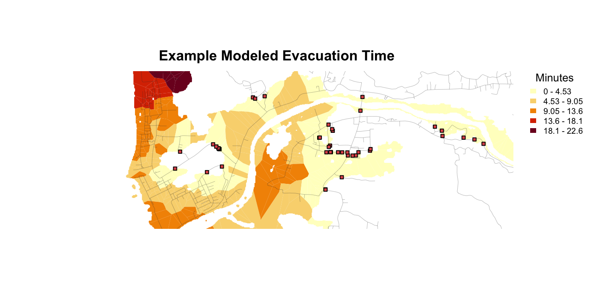

# Summary

`evacpath` is an R package for road-constrained pedestrian evacuation modeling with least-cost path analysis. The package takes three common spatial inputs, a hazard or inundation zone, a road or pathway network, and a digital elevation model (DEM), and returns spatial outputs describing distance to safety and estimated evacuation time. It is designed for tsunami-evacuation studies and related coastal hazards, while keeping the core workflow place-agnostic so that users can apply the same functions to different regions and hazard footprints.

The package builds on the R geospatial ecosystem, especially `terra` for raster and vector processing [@terra] and Joseph Lewis's `leastcostpath` package for least-cost path and conductance-surface calculations [@lewis2023leastcostpath; @lewis2021probabilistic]. `evacpath` packages the workflow used in recent open-source tsunami evacuation analysis [@cordero2025tsunami] into reusable functions with documented parameters for coordinate reference systems, grid resolution, walking speed, road buffers, escape-point detection, road-constrained movement masks, and output clipping. The package includes a compact example dataset, diagnostic vignettes, and export helpers for writing model outputs to geospatial files.

# Statement of need

Pedestrian evacuation modeling for coastal hazards often requires more than measuring straight-line distance from an inundation zone to high ground. People move through streets, paths, bridges, and other transportation corridors; elevation and slope affect walking cost; and coastal hazard boundaries can create misleading escape points if water-land edges are treated as safety boundaries. In tsunami applications, this distinction matters because the land-only inundation footprint is usually appropriate for origin generation and final mapping, while escape-point detection should avoid interpreting the shoreline as a valid exit from the hazard area.

Existing R packages provide the building blocks for geospatial modeling and least-cost path analysis. `terra` provides efficient raster and vector data structures and operations [@terra], while Joseph Lewis's `leastcostpath` provides functions for modeling movement potential and least-cost paths across landscapes [@lewis2023leastcostpath; @lewis2021probabilistic]. However, evacuation analysts still need to assemble many case-specific geoprocessing steps: preparing hazard zones, filtering road networks, identifying candidate escape or safety points, masking conductance surfaces to plausible travel corridors, sampling road-based origins, calculating least-cost distances, converting distance to travel time, and producing interpretable map outputs.

`evacpath` addresses this workflow gap. It gives emergency-planning researchers, geographers, and hazard analysts a reproducible package-level interface for road-constrained evacuation modeling. The package is intended for exploratory and research workflows where users have local hazard, road, and elevation data and need transparent, modifiable assumptions rather than a black-box evacuation model.

# State of the field

Many spatial analysis workflows in R rely on general-purpose packages such as `terra`, `sf`, and related visualization tools. These packages are powerful, but they are intentionally broad. JOSS software papers such as `tidyterra` [@hernangomez2023tidyterra] and `geospatialsuite` [@akanbi2026geospatialsuite] illustrate how domain-focused packages can make spatial workflows more reproducible by wrapping common operations, documenting assumptions, and providing examples tuned to specific user communities.

`evacpath` follows this pattern for pedestrian evacuation modeling. Rather than replacing `terra` or `leastcostpath`, it orchestrates them for a specific research task: estimating road-constrained distance and time from hazard-zone origins to safety points. The package contributes a tsunami-aware workflow that separates land-only hazard zones from water-combined escape zones, supports road-aware escape boundaries for bridges and causeways, and provides a high-level `run_evacpath()` wrapper alongside lower-level modular functions for diagnostic analysis.

# Software design

The package is organized as a modular pipeline. Input helpers read and project spatial data; hazard-zone helpers convert inundation rasters into raster or polygon zones; road helpers filter and buffer transportation networks; escape-boundary helpers identify points where roads cross the relevant safety boundary; conductance helpers create slope-based movement surfaces; distance helpers call `leastcostpath` to calculate minimum least-cost distances from origins to destinations; and output helpers generate evacuation-time polygons and write geospatial files.

This design balances convenience and auditability. The high-level `run_evacpath()` function executes the full workflow for users who want a single entry point. The same workflow is exposed as individual functions, allowing users to inspect intermediate products such as road masks, escape points, conductance rasters, origin samples, and output clipping areas. This is important for evacuation research because small preprocessing choices, such as whether a road network intersects an artificial study-area boundary, can change the location and number of candidate escape points.

The tsunami-specific design separates `hazard_zone` from `escape_zone`. The land-only `hazard_zone` is used for origin generation and final time-grid mapping. The `escape_zone` can include water so that the coastline is not treated as an artificial safety boundary. An optional road-aware escape boundary combines buffered roads with the escape zone before escape points are generated, preserving accessible bridge, causeway, or walkway segments over water. These choices are exposed as parameters rather than hidden constants.

# Research impact statement

`evacpath` formalizes an open-source least-cost path approach for tsunami evacuation research and planning, following the evacuation-analysis workflow described by @cordero2025tsunami. By packaging the workflow, the software makes it easier to reproduce published analyses, audit modeling assumptions, and adapt the same approach to new regions and hazard scenarios. The CRAN-ready package structure, tests, vignettes, and bundled example data provide community-readiness signals for researchers who need a transparent starting point for road-constrained evacuation modeling.

The package is especially useful for studies that compare evacuation accessibility across coastal communities, test sensitivity to walking-speed or road-buffer assumptions, or evaluate how escape-point definitions affect modeled evacuation times. Because the workflow uses standard geospatial file formats and returns `terra` objects, results can be integrated with other R spatial analysis and mapping tools.

# Availability

`evacpath` is distributed as an R package under the MIT license. The package includes user-facing documentation, vignettes for custom-region and diagnostic workflows, a compact example dataset in `inst/extdata`, and scripts for regenerating README figures. The package can be installed from the source repository, and a CRAN submission tarball has been prepared.

# Acknowledgements

The author acknowledges Teuku Muhammad Rasyif for providing the data used in the packaged example. The author also acknowledges the open-source R geospatial community and the developers of `terra` and `leastcostpath`, whose software provides the core spatial and least-cost path functionality used by `evacpath`.

# References
