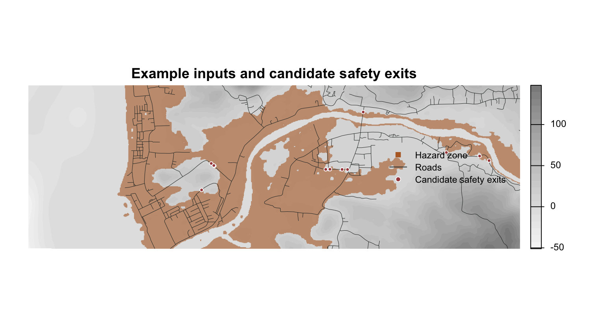
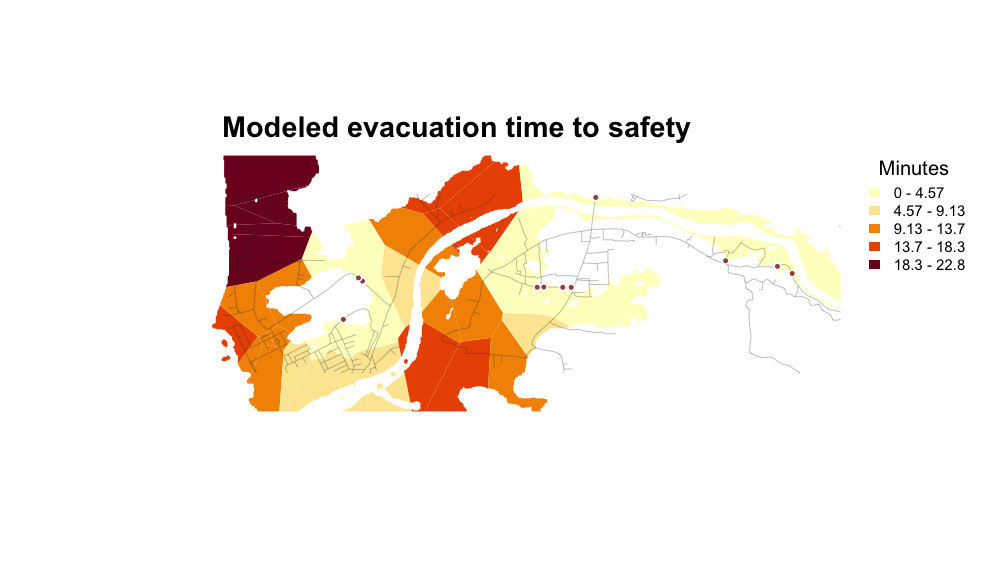
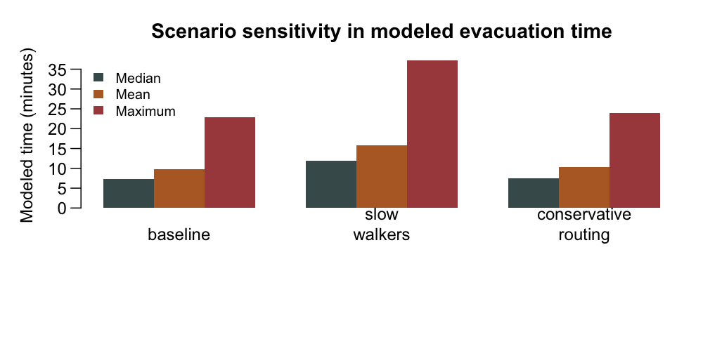

```{r, include = FALSE}
knitr::opts_chunk$set(collapse = TRUE, comment = "#>", eval = FALSE)
input_summary <- utils::read.csv(system.file(
  "extdata/pkgdown-example-input-summary.csv", package = "evacpath"
))
time_summary <- utils::read.csv(system.file(
  "extdata/pkgdown-example-time-summary.csv", package = "evacpath"
))
scenario_summary <- utils::read.csv(system.file(
  "extdata/pkgdown-example-scenario-summary.csv", package = "evacpath"
))
output_objects <- utils::read.csv(system.file(
  "extdata/pkgdown-example-output-objects.csv", package = "evacpath"
))
```

This gallery uses the packaged example data in a focused projected window. It
illustrates the package workflow and the layers to inspect; it is not a finished
evacuation plan or a substitute for local review.

## Example inputs



```{r input-summary, echo = FALSE, eval = TRUE}
knitr::kable(input_summary, col.names = c("Input", "Example value"))
```

## Candidate safety exits

The **hazard zone** is the land-only area used for evacuation origins and mapped
outputs. The **escape zone** combines the inundated area with water so the
shoreline is not treated as an artificial exit. Candidate safety exits are road
intersections with the selected escape boundary, not confirmed safe locations.

## Modeled evacuation time



The time surface converts modeled least-cost distance to safety with the chosen
walking speed. It is sensitive to the elevation surface, road mask,
escape-point logic, cost function, and routing neighbourhood.

```{r time-summary, echo = FALSE, eval = TRUE}
knitr::kable(time_summary, col.names = c("Modeled output", "Example value"))
```

## Scenario comparison



The slower-walker scenario changes the time conversion. The conservative-routing
scenario changes least-cost path settings and may therefore change both modeled
route geometry and distance.

```{r scenario-summary, echo = FALSE, eval = TRUE}
knitr::kable(
  scenario_summary[, c(
    "scenario", "walking_speed_mps", "median_evac_time", "mean_evac_time",
    "max_evac_time", "note"
  )],
  digits = 2,
  col.names = c("Scenario", "Walking speed", "Median min.", "Mean min.",
                "Maximum min.", "Assumption")
)
```

## Outputs users can write

`write_evac_outputs()` writes selected spatial outputs to an explicit directory.
For `prefix = "study_area"`, typical filenames include
`study_area_escape_points.gpkg`, `study_area_distance_points.gpkg`,
`study_area_evac_polygons.gpkg`, and `study_area_time_grid.gpkg`. The returned
object keeps the following layers available for inspection before anything is
written.

```{r output-objects, echo = FALSE, eval = TRUE}
knitr::kable(output_objects, col.names = c("Object", "Purpose"))
```

The reproducible generator for this gallery is
`inst/scripts/make-pkgdown-example-outputs.R`. It uses the packaged data and
creates the small figures and CSV summaries included here.
